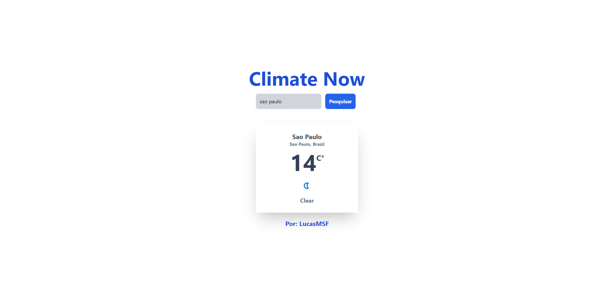

<h1 align="center">
   ☔ <a href="#">Climate Now</a> 
    
   </img>
   </img>

</h1>

 <a href="#sobre">Sobre</a> •
 <a href="#como-executar-o-projeto">Como Executar o Projeto</a> •
 <a href="#imagens">Imagens</a> •
 <a href="#feito-com">Feito com</a> • 
 <a href="#autor">Autor</a>

## Sobre

Desenvolvi esse projeto para execitar meus conhecimos em React e Typescript.

O React é uma biblioteca JavaScript de código aberto com foco em criar interfaces de usuário em páginas web.

## Como Executar o Projeto ?

Para executar o projeto, siga os seguintes passos:

 

* Abra o terminal dentro da pasta do projeto e execute o comando "npm run start"

 

Após isso acesse a URL localhost:3000

## Imagens

<h4>Tela principal</h4>

## Recursos

- [x] React Components
       
- [x] React Hooks
       
- [x] Requisições com axios
       
- [x] API Weather
       
- [x] Biblioteca SweetAlert

## Feito com

       

## Autor

<a href="https://github.com/lucasMSF">
 
  
 <b>Lucas Mathias</b></a> 
  

